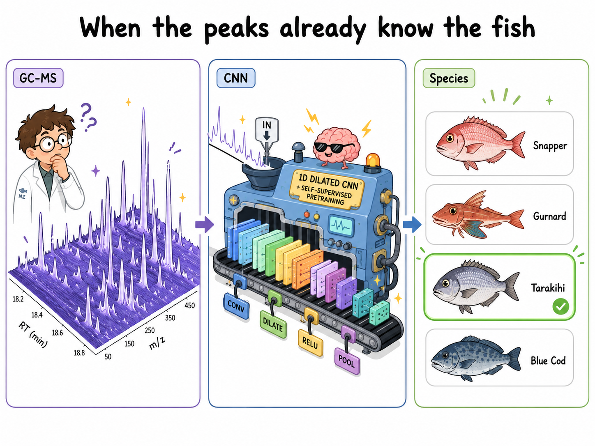

# MSFormer — NZ Fish Species Identification by GC-MS

[](https://www.python.org/downloads/)
[](https://pytorch.org/)
[](https://scikit-learn.org/)
[](LICENSE)



Species identification of four commercially important New Zealand fish (Snapper, Gurnard, Tarakihi, Blue Cod) from GC-MS lipid profiles using a 1D dilated CNN with self-supervised pretraining.

---

## Dataset

103 GC-MS samples from six biological individuals across four species and six body parts (frame, gonad, head, liver, rest-of-guts, skin).

| Label | Species | n |
|---|---|---|
| 0 | SNA — Snapper (*Pagrus auratus*) | 15 |
| 1 | GUR — Gurnard (*Chelidonichthys kumu*) | 14 |
| 2 | TAR — Tarakihi (*Nemadactylus macropterus*) | 17 |
| 3 | BCO — Blue Cod (*Parapercis colias*) | 57 |

Raw data: 2D GC-MS chromatograms (4800 RT scans × 344 m/z channels, 50–543 Da).  
Preprocessing: uniform 200-bin RT resampling, sqrt + L2 normalisation per bin.

Preprocessed arrays and chromatograms are committed to this repo — no re-processing needed to run training.

---

## Model

**ChromatogramCNN** — a 1D dilated CNN operating on the RT axis of the 2D chromatogram.

```
[B, 200, 1000]                    per-sample 2D chromatogram
    ↓  per-bin spectral embedding
[B, 200, 128]                     RT sequence of spectral features
    ↓  three dilated ResBlocks (kernel=7, dilation=1/2/4)
[B, 128, 200]                     temporal feature map
    ↓  global max-pool ∥ soft attention-pool
[B, 256]                          dual-pooled representation
    ↓  linear head
[B, 4]                            class logits
```

Three conditions are evaluated:

| Condition | Per-bin encoder | Pretrained? |
|---|---|---|
| `from_scratch` | `Linear(1000 → 128)` | No |
| `chroma_pretrain` | `Linear(1000 → 128)` | Yes — next-frame prediction on synthetic GC-MS (MoNA/MassBank) |
| `frozen_embed` | `DensePatchEmbedding` (MSM encoder, frozen) | Yes — Masked Spectra Modelling on MoNA/MassBank |

---

## Repository Structure

```
msformer/
├── configs/
│   ├── pretrain_msm.yaml              # MSM encoder pretraining
│   ├── pretrain_chroma.yaml           # ChromaCNN next-frame pretraining
│   ├── finetune_fish_oil.yaml         # Baselines config
│   └── finetune_fish_oil_chroma.yaml  # ChromatogramCNN fine-tuning
├── data/
│   └── fish_oil/
│       ├── X.npy                      # [103, 1000] sum spectra
│       ├── y.npy                      # [103] labels
│       ├── groups.txt                 # biological group per sample
│       ├── sample_ids.txt             # sample name per row
│       ├── chroma/                    # [103 × 200 × 1000] RT-binned chromatograms
│       └── scans/                     # [103 × K × 1000] per-scan spectra
├── scripts/
│   ├── 01_download_pretrain_data.py   # download MoNA + MassBank
│   ├── 02_preprocess_pretrain_data.py # build data/pretraining/spectra.h5
│   ├── 03_pretrain.py                 # train MSM encoder
│   ├── 04_finetune_evaluate.py        # full CV evaluation (all CNN conditions)
│   ├── 05_run_baselines.py            # PLS-DA, RF, SVM, MLP baselines
│   ├── 07_smoke_test.py               # single seed × fold sanity check
│   ├── 08_pretrain_chroma.py          # pretrain ChromaCNN on synthetic GC-MS
│   ├── preprocess_fish_oil.py         # raw CSV → X.npy, y.npy
│   ├── preprocess_fish_oil_chroma.py  # raw CSV → chroma/*.npz
│   └── preprocess_fish_oil_scans.py   # raw CSV → scans/*.npz
└── src/msformer/
    ├── data/                          # datasets, download, preprocessing
    ├── models/                        # ChromatogramCNN, SpectrumEncoder, MSM
    ├── training/                      # pretraining and fine-tuning loops
    ├── evaluation/                    # baselines, stats
    └── downstream/                    # fish_oil data loaders
```

---

## Installation

```bash
git clone https://github.com/woodRock/msformer.git
cd msformer
python -m venv .venv && source .venv/bin/activate
pip install -e ".[dev]"
```

---

## Running on a GPU Cluster

The preprocessed fish oil data is committed — clone the repo and start from step 3 or 4.

### Step 1 — Download pretraining spectra (if needed)

```bash
python scripts/01_download_pretrain_data.py
```

Outputs `data/pretraining/raw/combined_ei_spectra.json` from MoNA + MassBank EU.

### Step 2 — Build HDF5 dataset (if needed)

```bash
python scripts/02_preprocess_pretrain_data.py
```

Outputs `data/pretraining/spectra.h5` (~9,500 EI-MS spectra, sqrt + L2 normalised).

### Step 3 — Pretrain the MSM encoder

```bash
python scripts/03_pretrain.py --config configs/pretrain_msm.yaml
```

Checkpoint saved to `checkpoints/msm/best.pt`.

### Step 4 — Pretrain ChromaCNN (next-frame prediction)

Uses synthetic GC-MS chromatograms generated on-the-fly from `spectra.h5` — no fish oil data used, so there is no information leakage into fine-tuning CV folds.

```bash
python scripts/08_pretrain_chroma.py --device cuda:0
```

Checkpoint saved to `checkpoints/chroma_pretrain/best.pt`.

### Step 5 — Full CV evaluation (ChromatogramCNN)

10 seeds × 5-fold stratified CV (~10 min on GPU).

```bash
python scripts/04_finetune_evaluate.py --device cuda:0
```

Results saved to `results/fish_oil/chroma_results.json`.

### Step 6 — Classical baselines

```bash
python scripts/05_run_baselines.py
```

Evaluates PLS-DA, RF, SVM, MLP on three feature representations:
- `sum` — per-m/z sum spectrum
- `max_proj` — per-m/z maximum across RT (peak heights)
- `chroma_pca` — full 2D chromatogram, 50 PCs within each CV fold

Results saved to `results/fish_oil/baseline_gcms_{representation}_results.json`.

### Step 7 — Smoke test (optional)

Quick single-seed × single-fold check before committing to the full run:

```bash
python scripts/07_smoke_test.py --seed 0 --fold 0 --epochs 100
```

---

## Baseline Results

| Method | Representation | Balanced Accuracy |
|---|---|---|
| PLS-DA | chroma_pca | **0.703 ± 0.091** |
| SVM    | chroma_pca | 0.693 ± 0.108 |
| RF     | sum        | 0.696 ± 0.113 |
| PLS-DA | sum        | 0.429 ± 0.114 |

10 seeds × 5-fold CV. The chroma_pca representation (full 2D chromatogram → 50 within-fold PCs) gives the strongest baselines.

---

## Citation

```bibtex
@misc{wood2026msformer,
  author = {Wood, Jesse},
  title  = {MSFormer: GC-MS Fish Species Identification with Self-Supervised Pretraining},
  year   = {2026},
  url    = {https://github.com/woodRock/msformer}
}
```

**Pretraining data:**
- MoNA — MassBank of North America: [mona.fiehnlab.ucdavis.edu](https://mona.fiehnlab.ucdavis.edu)
- MassBank EU: [massbank.eu](https://massbank.eu)
